<mark>**Note that this document order from FP4 -> FP1**</mark>

<mark>Please sign up for the study</mark> at [https://tinyurl.com/pui-study](https://tinyurl.com/pui-study) to allow us to use your submission to create a better GenAI assistant for designers!

---

# **FP4 \- Final Project Writeup**

Feel free to refer to this [Markdown Cheat Sheet](https://www.markdownguide.org/cheat-sheet/) to make your writeup more organized, and you can preview your markdown file in VSCode [Markdown editing with Visual Studio Code](https://code.visualstudio.com/docs/languages/markdown#_markdown-preview). 

## Part 1: Website Description

Describe your website (300 words).

* What is the purpose of your website?   
* Who is the target audience?  
* What information do you convey with your website?   
* How is it interesting and engaging? 

## Part 2: User Interaction

How a user would interact with your website? For each step, briefly but clearly state the interaction type & how we should reproduce it.

1. Interaction type. Click on X on page Y / scroll on page X, etc.  
2. 

## Part 3: External Tool

Describe what important external tool you used (JavaScript library, Web API, animations, or other). Following the bulleted list format below, reply to each of the prompts.

1. Name of tool1  
   * Why did you choose to use it over other alternatives? (2 sentences max)  
   * How you used it? (2 sentences max)  
   * What does it add to your website? (2 sentences max)  
2. Name of tool2

## Part 4: Design Iteration

Describe how you iterated on your prototypes, if at all, including any changes you made to your original design while you were implementing your website and the rationale for the changes. (4-8 sentences max)

## Part 5: Implementation Challenge

What challenges did you experience in implementing your website? (2-4 sentences max)

## Part 6: Generative AI Use and Reflection

Describe how you used Generative AI tools to create this final project (fill in the following information, write \~500 words in total).

Document your use of all GenAI tools — ChatGPT, Copilot, Claude, Cursor, etc. using the template below. Add/Delete rows or bullet points if needed, and replace Tool1/Tool2 with the name of the tool.

### Usage Experiences by Project Aspects

Feel free to edit the column \_ (other?) or add more columns if there's any other aspect in your project you've used the GenAI tools for.

For the following aspects of your project, edit the corresponding table cell to answer:
- *Usage*: Whether you used / did not use this tool for the aspect. Enter [Yes/No]
- *Productivity*: Give a rating on whether this tool makes your productivity for X aspect [1-Much Reduced, 2-Reduced, 3-Slightly Reduced, 4-Not Reduced nor Improved, 5-Slightly Improved, 6-Improved, 7-Much Improved].

| Tool Name | Ratings | design | plan | write code | debug | \_ (other?) |
| :---- | :---- | :---- | :---- | :---- | :---- | :---- |
| Tool1 | Usage | Yes/No | Yes/No | Yes/No | Yes/No | Yes/No |
| Tool1 | Productivity | 1~7 | 1~7 | 1~7 | 1~7 | 1~7 |
| Tool2| Usage | Yes/No | Yes/No | Yes/No | Yes/No | Yes/No |
| Tool2 | Productivity | 1~7 | 1~7 | 1~7 | 1~7 | 1~7 |

### Usage Reflection

> Impact on your design and plan 
* It matched my expectations and plan in [FP2](#generative-ai-use-plan) in that … For example, 
  1. Tool1: 
  2. Tool2:
* It did not match my expectations and plan in [FP2](#generative-ai-use-plan) in that … For example, 
  1. Tool1: 
  2. Tool2:
* GenAI tool did/did not influence my final design and implementation plan because … For example, 
  1. Tool1: 
  2. Tool2:

> Use patterns
* I accepted the generations when …  For example, 
  1. Tool1: this tool once suggested … and I adjusted my design according to the suggestion because … 
  2. Tool2: 
* I critiqued/evaluated the generated suggestions by … For example, 
  1. Tool1: this tool once suggested … but I modified/rejected the suggestion because … 
  2. Tool2: 

> Pros and cons of using GenAI tools
* Pros
  1. Tool1: 
  2. Tool2:
* Cons
  1. Tool1: 
  2. Tool2:

### Usage Log

Document the usage logs (prompts and chat history links) for the GenAI tools you used. Some tools may not have an easy way to share usage logs, just try your best! Some instructions for different tools:

1. [ChatGPT](https://help.openai.com/en/articles/7925741-chatgpt-shared-links-faq) / [Gemini](https://support.google.com/gemini/answer/13743730?hl=en&co=GENIE.Platform%3DDesktop): share the anonymous link to all of your chat histories relevant to this project
2. [GitHub Copilot (VSCode)](https://code.visualstudio.com/docs/copilot/copilot-chat#:~:text=You%20can%20export%20all%20prompts%20and%20responses%20for%20a%20chat%20session%20in%20a%20JSON%20file%20with%20the%20Chat%3A%20Export%20Session...%20command%20(workbench.action.chat.export)%20in%20the%20Command%20Palette.): export chat histories relevant to this project.

---

# **FP3 \- Final Project Check-in**

Document the changes and progress of your project. How have you followed or changed your implementation & GenAI use plan and why? Remember to commit your code to save your progress.

## Implementation Plan Updates

- [ ] ...

## Generative AI Use Plan Updates

- [ ] ...

Remember to keep track of your prompts and usage for [FP4 writeup](#part-6-generative-ai-use-and-reflection).

---

# **FP2 \- Evaluation of the Final project**

## Project Description

The basic idea is to create a website that will support and showcase, Angels on Stage, a performing arts program designed for children with disabilities. I would like this website to be more visually eye-catching than it is currently so that it can drive more traffic and donations. Additionally, it should fit the vision and mission of the program so that the staff who manage the website could make any necessary adjustments if they decided to adopt the design.

## High-Fi Prototypes

### *Prototype 1*
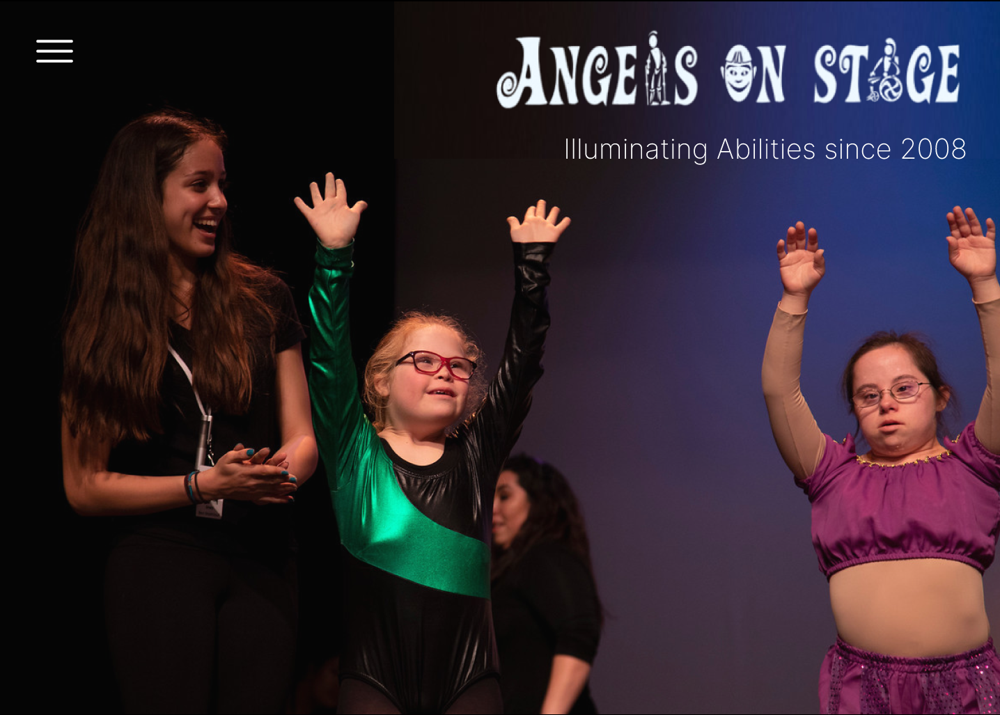
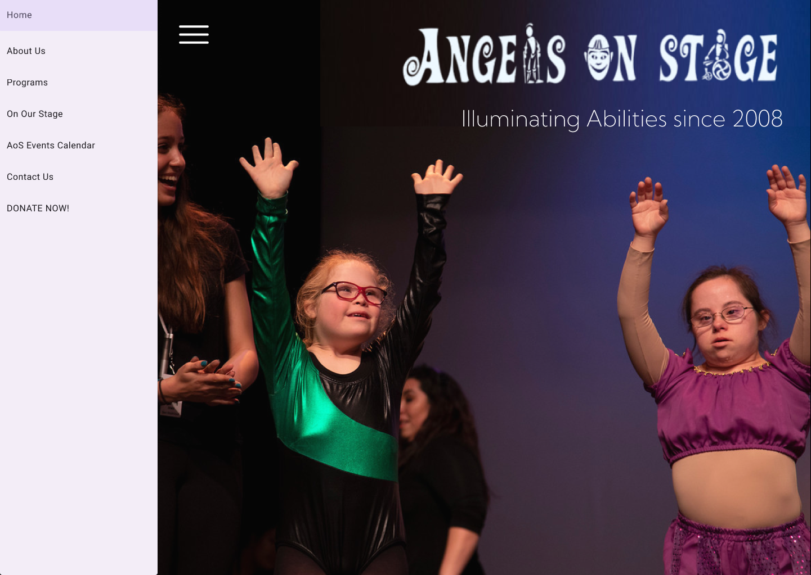

A brief description and summary of the user feedback (\<100 words, 2 images) 

### *Prototype 2*
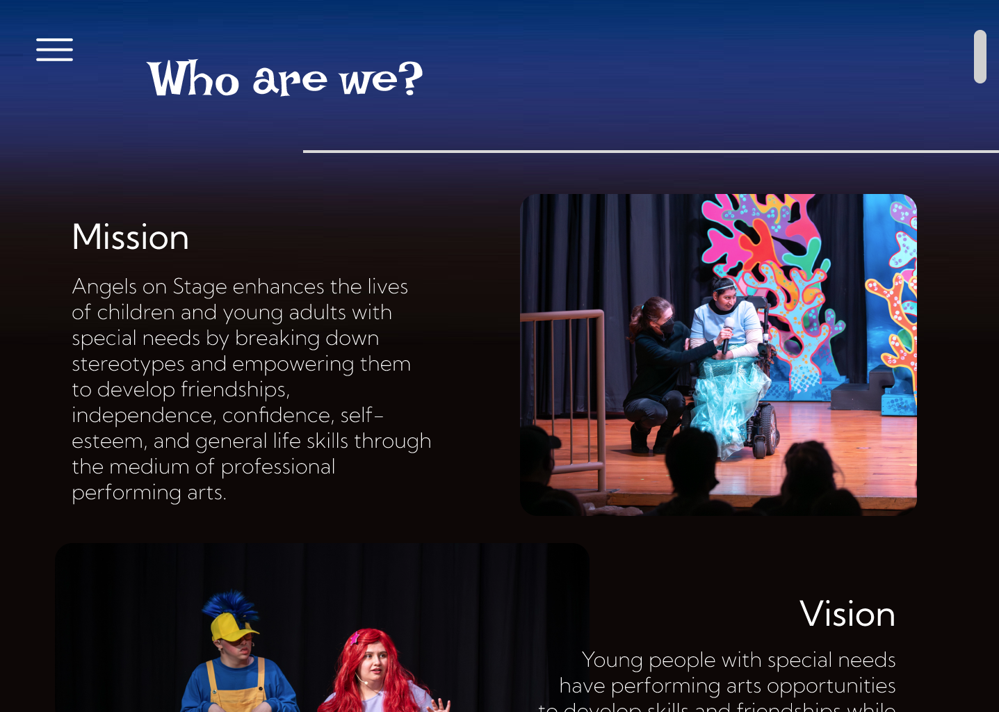
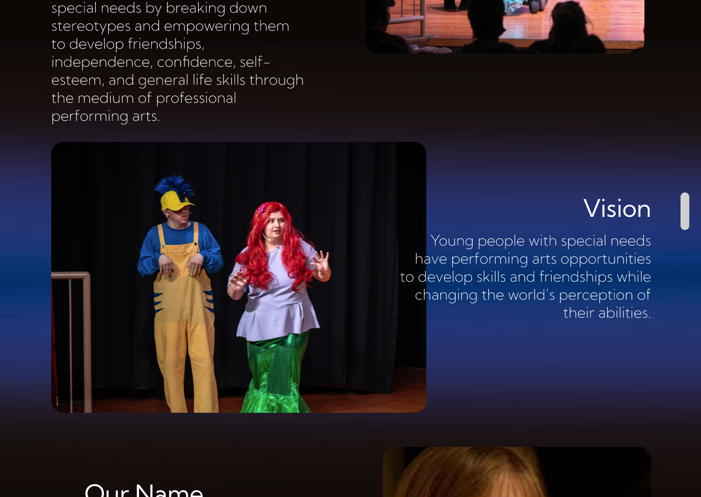
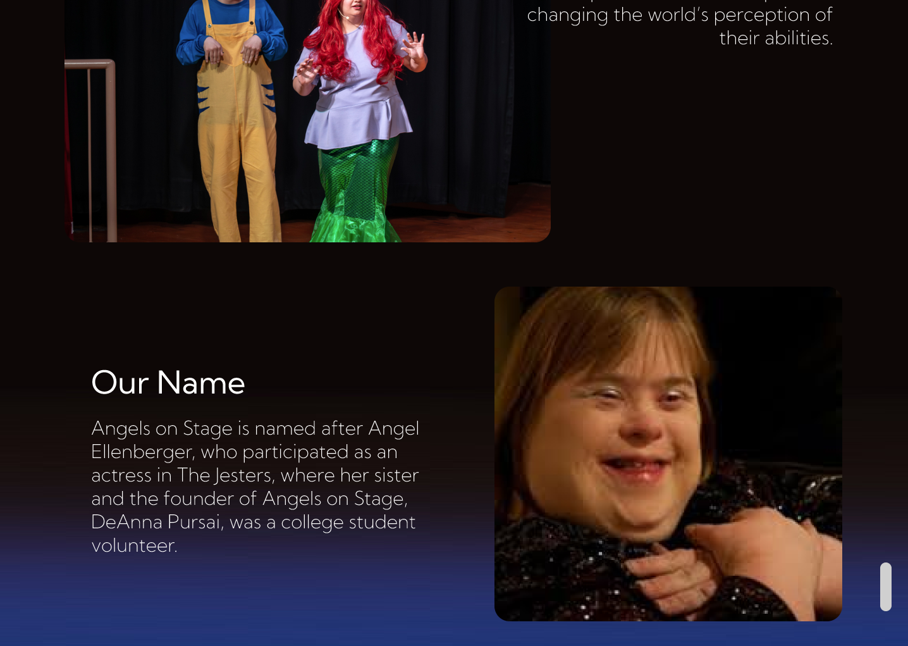
…

## Usability Test
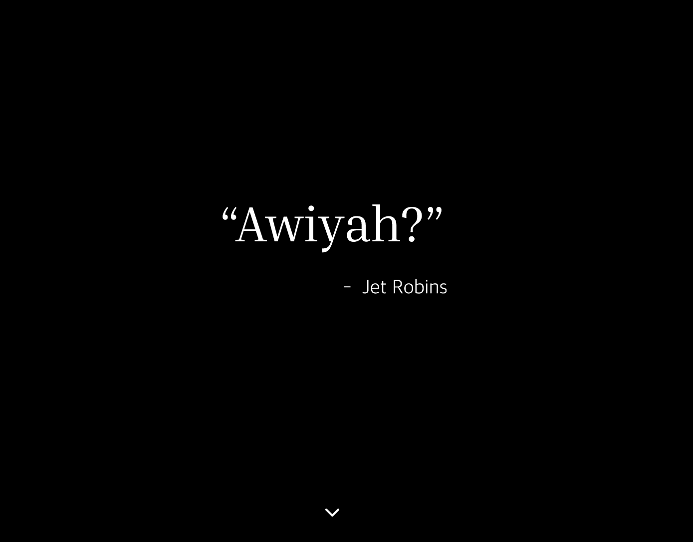
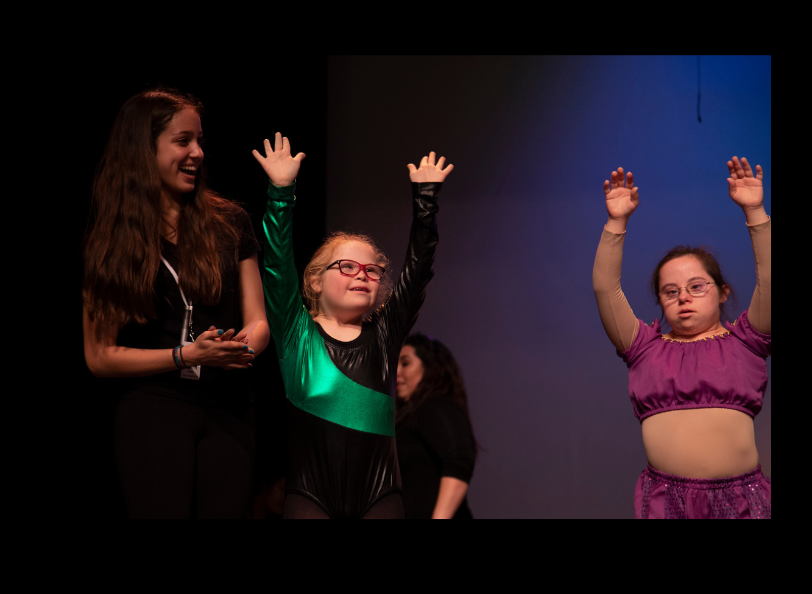
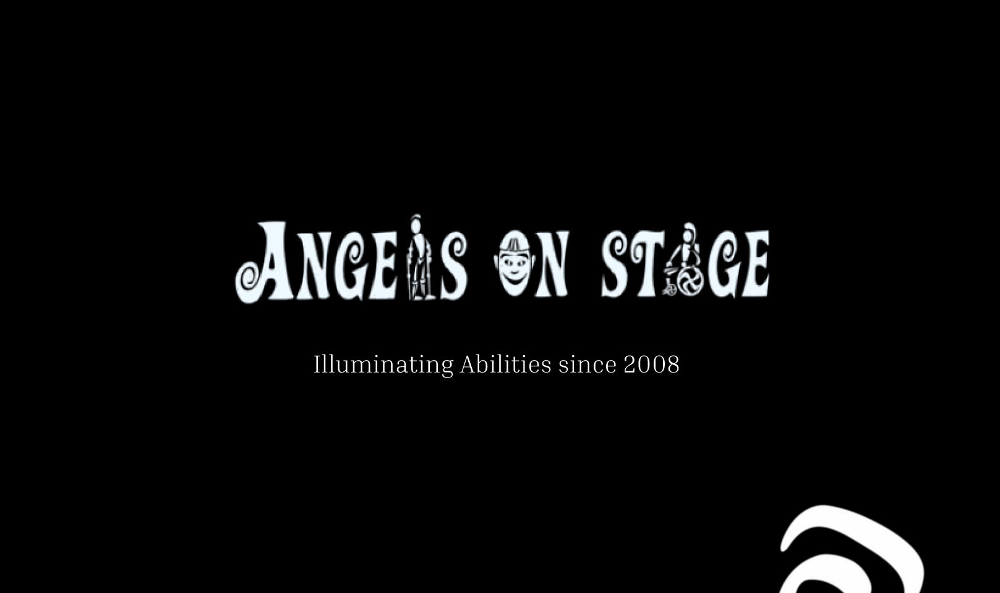
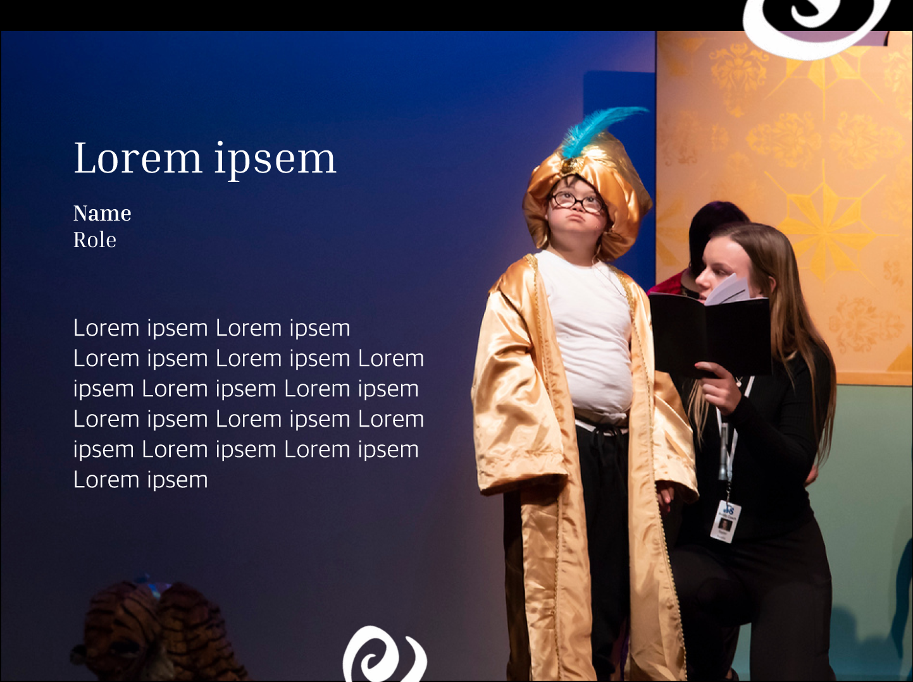
Discuss the user feedback you got during the evaluation / usability test (\~300 words). Indicate which feedback you implemented, inspired new directions, or otherwise influenced your final design. 

## Updated Designs

Show screenshots of your updated design based on the user feedback (\<100 words, \~2 images).

## Feedback Summary

Summarize the feedback you received in the lab session and discuss how it influenced your design (\~300 words). 

## Milestones

Outline weekly milestones to plan your expected implementation progress until the end of the semester (\~300 words). 

### *Implementation Plan*

- [ ] Week 9 Oct 28 \- Nov 1:
  - [X] FP1 due
  - [ ] ...
  
- [ ] Week 10 Nov 4 \- Nov 8:   
  - [ ] FP2 due

- [ ] Week 11 Nov 11 \- Nov 15:  
- [ ] Week 12 Nov 18 \- Nov 22:   
- [ ] Week 13 Nov 25 \- Nov 29:  

  - [ ] Thanksgiving  
- [ ] Week 14 Dec 2 \- Dec 6:  
  - [ ] FP4 due 

### *Libraries and Other Components*

List the JS libraries and other components (if applicable) that you plan to use. 
* 

## Generative AI Use Plan

Outline how you plan to use Generative AI tools to aid in the implementation (\~300 words).

### *Tool Use*

 What would you use? Edit the list given your plan. For each tool, explain briefly on what do you expect Generative AI to help you with and what might it not be able to help you with.

* ChatGPT  
  * I will use it for … because it can help me …  
  * I will not use it for … because it might not be able to help me with …   
* GitHub Copilot  
* ...

### *Responsible Use*

How would you use Generative AI responsibly? 

---

# **FP1 \- Proposal for Critique**

## Idea Sketches

### *Idea 1 - Personal Portfolio*

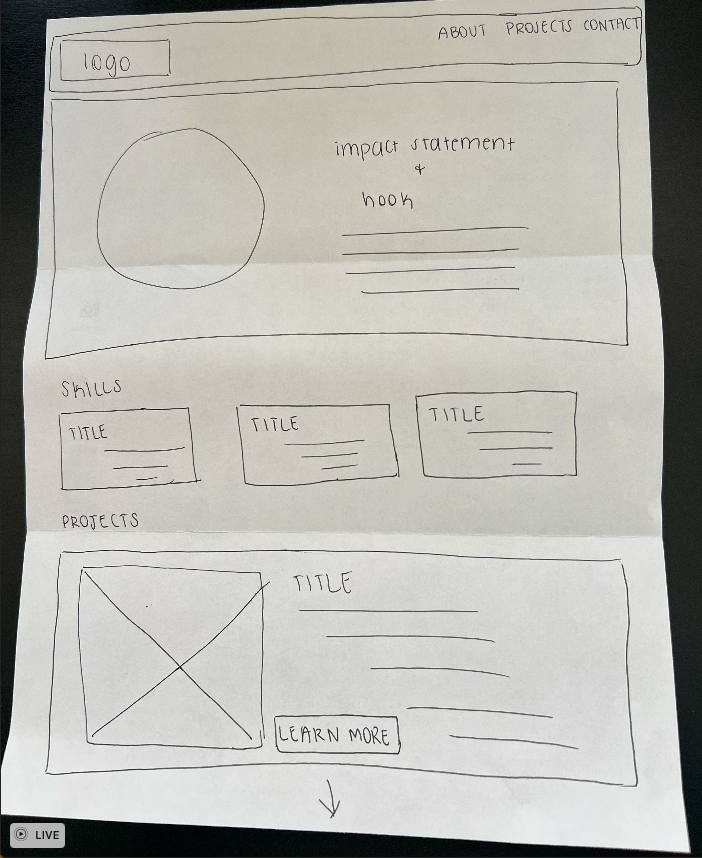
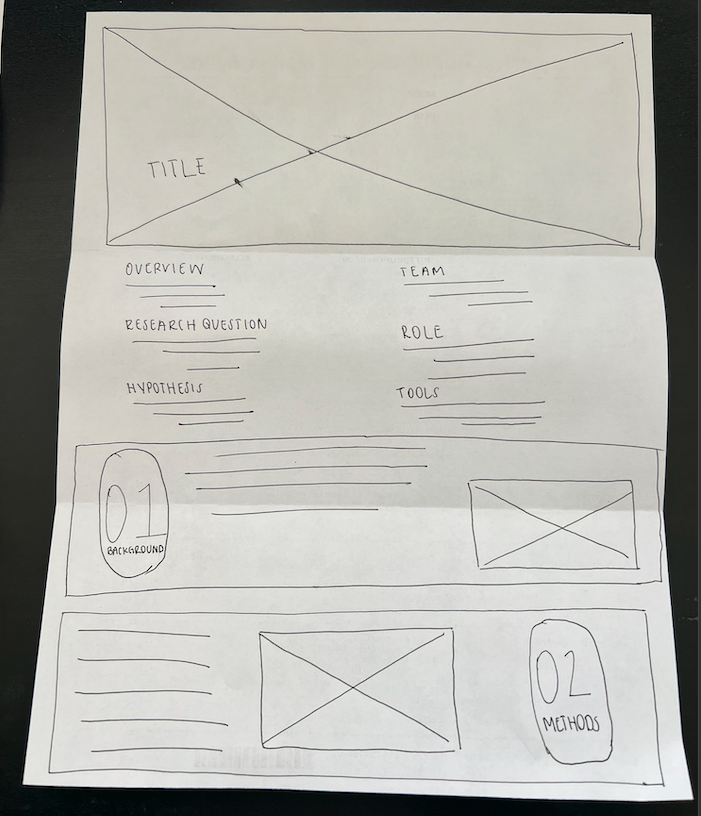

The basic idea is to create a competitive research portfolio that showcases my previous research experience and makes me stand out to employers.  

* I plan to make the design interactive by having buttons that are clickable which allow the user to navigate to the individual project pages
* The accessibility piece of this design will come in the form of tab navigation, color contrast, and large, readable text
* I would like to convey to employers that I have professional work experience in the user experience research field and that I will be a dedicated, hardworking employee

### *Idea 2 - The Ramayana*
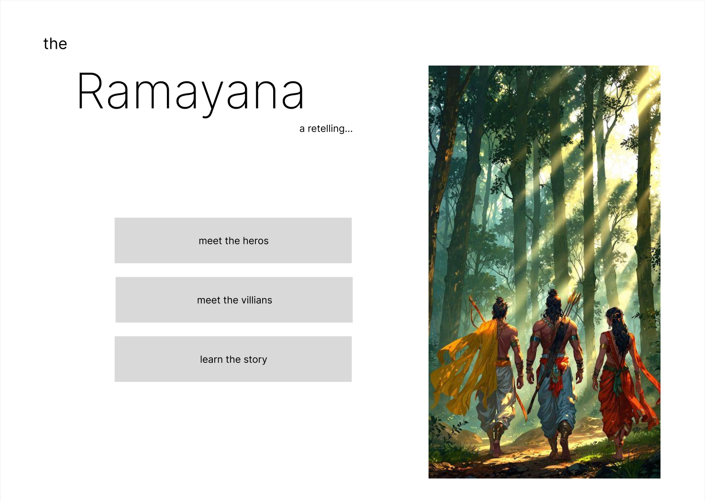

The basic idea is to create an interactive learning experience for users to understand the history of Diwali by outlining the story of the Ramayana.  

* I plan to make the design interactive by allowing users to hover over each character card to learn more about them, create an interactive timeline which users can click on to be taken to a portion of the storyline.
* The accessibility piece of this design will come in the form of tab navigation, color contrast, and large, readable text.
* I would like to convey to users the importance of the story of the Ramayana. I want this platform to educate users about the origins and significance of Diwali, including how it is celebrated in the Hindu culture.  

### *Idea 3 - Angels on Stage*
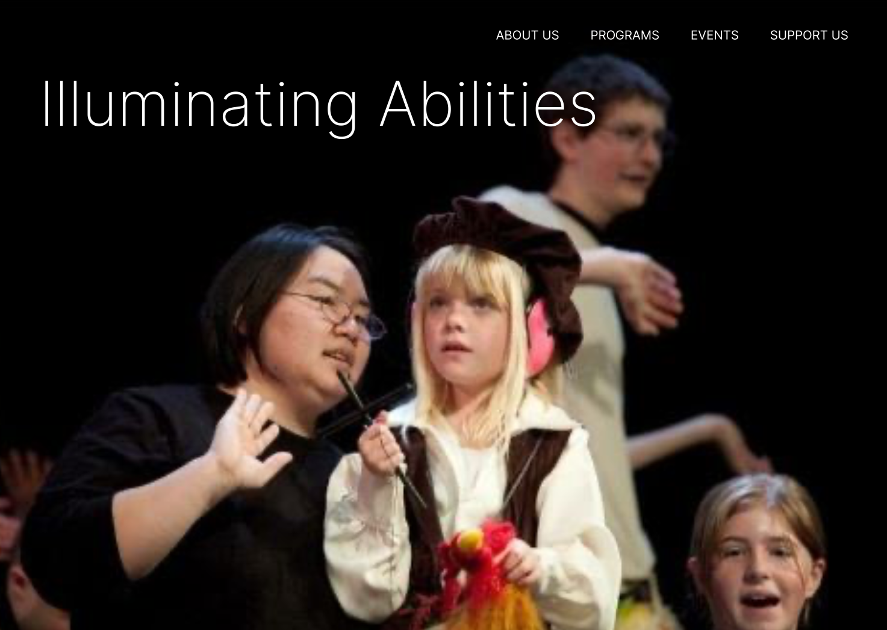

The basic idea is to create a website that will support and showcase, Angels on Stage, a performing arts program designed for children with disabilities.  

* I plan to make the design interactive by allowing users to visit each page on the website through the site navigation menu. They can click into each page which will have a variety of informational content (e.g., videos, photos, text, etc). 
* The accessibility piece of this design will come in the form of tab navigation, color contrast, and large, readable text.
* I would like to convey to users that disability is not something that limits individuals but rather something to celebrate. I would also like to use this platform to dispel common stereotypes.

## Feedback Summary

### *Idea 1 - Personal Portfolio*
I quickly shared this idea with a classmate during a speed dating critique session but opted not to get feedback since I decided early on to go in a different direction. My focus is shifting toward user experience research within the assistive technology space and I don’t feel that a JavaScript portfolio would best showcase my skills. Additionally, I would not be able to maintain it over time. Instead, I want to use a site like SquareSpace or Wix to visually demonstrate my abilities, with an emphasis on design over code.

### *Idea 2 - The Ramayana*
I got a range of feedback from my peers which was extremely helpful in determining which direction to go in. Brenna helped me consider a different visual style for the Ramayana website. Instead of an interactive timeline to show the story progression, she suggested I use parallax scrolling style to create a visual story. In this format, the story would be told vertically with various strong visual components. We also discussed making the website look and feel like a book with page flipping animations, a play on the idea that this is a Hindu epic which was historically depicted in a physical book. Seun suggested I compliment the parallax style by incorporating a progression bar so users don’t get frustrated with the continuous scrolling motion. She also added that I could include interactive anchor points on the progression bar so that users can skip ahead or backward. Finally, Niki mentioned that visuals will be hard to find for this project due to the fact that this story is an ancient religious text. She mentioned that I could use the p5 library to generate some artwork to complement the sparse visuals I could find. She said I could also supplement the visual component by animating my character cards. 

### *Idea 3 - Angels on Stage*
I also got great feedback on my Angels on Stage project proposal and this feedback ultimately led me to deciding on this idea. Lucy mentioned that thinking of the users before designing the interactive components was a great starting point and the right way to go about it. She did mention that an informal user test could be helpful to get an idea of users’ mental model of disability in order to effectively dispel their stereotypes about the topic. Evolone mentioned that I should consider which data I would like to pull in using an API. She suggested I think about data visualization through a pre-packaged library or software that would report on statistics around disability because this could emotionally hook users. Finally, Seun told me to strongly focus on the accessibility features of the website since this would be tailored to individuals with disabilities and their families. 

## Feedback Digestion
I made the decision to develop the Angels on Stage (AoS) website because I believe it aligns the most with my values and career aspirations. As I think about what the website design would look like, I believe it would serve me well to take components of feedback from both projects. Brenna’s feedback about using the parallax scrolling style to tell a visual story could be extremely powerful for the AoS website. It would help make the website visually engaging, creating an immersive experience that matches the dynamic storytelling aspect of this organization. Since visuals are key in this style, I reached out to my former volunteer coordinators for access to a collection of high-quality images that would enhance this parallax style and make the site feel cohesive. 

I also plan to incorporate Seun’s progression bar suggestion that would help users anchor to various points in the website. This would dispel frustration and create more of a story with the ability to jump forward and backwards. 

Finally, I plan to incorporate Lucy’s suggestion to perform an informal user test to understand the mental model of disability and learn about common stereotypes around disability. This would guide my language and interactive components to effectively convey the message. 

Once the design is completed, I plan to send it out to the AoS team so that they may consider using the design if it aligns with their vision. Of course, there will be no obligation to do so, but I would like to welcome their feedback throughout the process and would love it if my design could impact their community in a positive way. 

