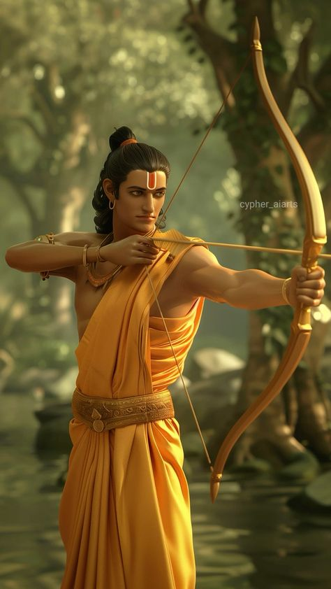

<mark>**Note that this document order from FP4 -> FP1**</mark>

<mark>Please sign up for the study</mark> at [https://tinyurl.com/pui-study](https://tinyurl.com/pui-study) to allow us to use your submission to create a better GenAI assistant for designers!

---

# **FP4 \- Final Project Writeup**

Feel free to refer to this [Markdown Cheat Sheet](https://www.markdownguide.org/cheat-sheet/) to make your writeup more organized, and you can preview your markdown file in VSCode [Markdown editing with Visual Studio Code](https://code.visualstudio.com/docs/languages/markdown#_markdown-preview). 

## Part 1: Website Description

Describe your website (300 words).

* What is the purpose of your website?   
* Who is the target audience?  
* What information do you convey with your website?   
* How is it interesting and engaging? 

## Part 2: User Interaction

How a user would interact with your website? For each step, briefly but clearly state the interaction type & how we should reproduce it.

1. Interaction type. Click on X on page Y / scroll on page X, etc.  
2. 

## Part 3: External Tool

Describe what important external tool you used (JavaScript library, Web API, animations, or other). Following the bulleted list format below, reply to each of the prompts.

1. Name of tool1  
   * Why did you choose to use it over other alternatives? (2 sentences max)  
   * How you used it? (2 sentences max)  
   * What does it add to your website? (2 sentences max)  
2. Name of tool2

## Part 4: Design Iteration

Describe how you iterated on your prototypes, if at all, including any changes you made to your original design while you were implementing your website and the rationale for the changes. (4-8 sentences max)

## Part 5: Implementation Challenge

What challenges did you experience in implementing your website? (2-4 sentences max)

## Part 6: Generative AI Use and Reflection

Describe how you used Generative AI tools to create this final project (fill in the following information, write \~500 words in total).

Document your use of all GenAI tools — ChatGPT, Copilot, Claude, Cursor, etc. using the template below. Add/Delete rows or bullet points if needed, and replace Tool1/Tool2 with the name of the tool.

### Usage Experiences by Project Aspects

Feel free to edit the column \_ (other?) or add more columns if there's any other aspect in your project you've used the GenAI tools for.

For the following aspects of your project, edit the corresponding table cell to answer:
- *Usage*: Whether you used / did not use this tool for the aspect. Enter [Yes/No]
- *Productivity*: Give a rating on whether this tool makes your productivity for X aspect [1-Much Reduced, 2-Reduced, 3-Slightly Reduced, 4-Not Reduced nor Improved, 5-Slightly Improved, 6-Improved, 7-Much Improved].

| Tool Name | Ratings | design | plan | write code | debug | \_ (other?) |
| :---- | :---- | :---- | :---- | :---- | :---- | :---- |
| Tool1 | Usage | Yes/No | Yes/No | Yes/No | Yes/No | Yes/No |
| Tool1 | Productivity | 1~7 | 1~7 | 1~7 | 1~7 | 1~7 |
| Tool2| Usage | Yes/No | Yes/No | Yes/No | Yes/No | Yes/No |
| Tool2 | Productivity | 1~7 | 1~7 | 1~7 | 1~7 | 1~7 |

### Usage Reflection

> Impact on your design and plan 
* It matched my expectations and plan in [FP2](#generative-ai-use-plan) in that … For example, 
  1. Tool1: 
  2. Tool2:
* It did not match my expectations and plan in [FP2](#generative-ai-use-plan) in that … For example, 
  1. Tool1: 
  2. Tool2:
* GenAI tool did/did not influence my final design and implementation plan because … For example, 
  1. Tool1: 
  2. Tool2:

> Use patterns
* I accepted the generations when …  For example, 
  1. Tool1: this tool once suggested … and I adjusted my design according to the suggestion because … 
  2. Tool2: 
* I critiqued/evaluated the generated suggestions by … For example, 
  1. Tool1: this tool once suggested … but I modified/rejected the suggestion because … 
  2. Tool2: 

> Pros and cons of using GenAI tools
* Pros
  1. Tool1: 
  2. Tool2:
* Cons
  1. Tool1: 
  2. Tool2:

### Usage Log

Document the usage logs (prompts and chat history links) for the GenAI tools you used. Some tools may not have an easy way to share usage logs, just try your best! Some instructions for different tools:

1. [ChatGPT](https://help.openai.com/en/articles/7925741-chatgpt-shared-links-faq) / [Gemini](https://support.google.com/gemini/answer/13743730?hl=en&co=GENIE.Platform%3DDesktop): share the anonymous link to all of your chat histories relevant to this project
2. [GitHub Copilot (VSCode)](https://code.visualstudio.com/docs/copilot/copilot-chat#:~:text=You%20can%20export%20all%20prompts%20and%20responses%20for%20a%20chat%20session%20in%20a%20JSON%20file%20with%20the%20Chat%3A%20Export%20Session...%20command%20(workbench.action.chat.export)%20in%20the%20Command%20Palette.): export chat histories relevant to this project.

---

# **FP3 \- Final Project Check-in**

Document the changes and progress of your project. How have you followed or changed your implementation & GenAI use plan and why? Remember to commit your code to save your progress.

## Implementation Plan Updates

- [ ] ...

## Generative AI Use Plan Updates

- [ ] ...

Remember to keep track of your prompts and usage for [FP4 writeup](#part-6-generative-ai-use-and-reflection).

---

# **FP2 \- Evaluation of the Final project**

## Project Description

The basic idea is to create a website that will support and showcase Angels on Stage, a performing arts program designed for children with disabilities. I would like this website to be very visually eye-catching and driven by storytelling so that it would be more impactful. Ideally, it will showcase images and quotes from the Angels (the participants) that will come together to tell a full story. Additionally, it should fit the vision and mission of the program so that the staff who manage the company’s website could find a place for it in their current design. 

## High-Fi Prototypes

### *Prototype 1*

This prototype depicts my vision of the home page and navigation menu. I wanted the hero image to be powerful and impactful, so I opted for a hamburger menu so as to not detract from the image. The feedback I got from classmates was that a hamburger menu may be too many clicks for the user to be able to access what they are looking for, especially in the case when they come to the website looking for something specific. They shared that I could opt for a regular navigation menu where each menu item lives on the home page. They suggested I make the text on the redesigned navigation bar a light gray instead of white so that it does not detract from the hero image as much. 

### *Prototype 2*

This prototype is of the About Me section of the website. The purpose is to walk users through the vision and mission of Angels on Stage as well as share a bit about its origins. It is intended to be in a parallax scrolling style and I was actually able to accomplish this using Figma SmartAnimate (although I was not able to attach a video to the README file). The feedback from users was that I should consider not overlapping the text with the image on the second screenshot because it does not look intentional. Additionally, users shared that I should align all the text (either right or left) so that it looks consistent while users are scrolling. 

## Usability Test
I created prototype 1 and 2 for the FP2 and conducted my usability test with a classmate on those two designs. I will discuss the findings here and then discuss invaluable feedback I got during the lab session which actually inspired me to take an entirely different approach to the website. 

Since I conducted a usability test with a think-aloud procedure, I got to hear the user’s perspectives on some elements of the design. During the usability test on prototype 1, I found that the user was able to access the hamburger menu without issues. She did say that the hero image was perfect for the landing page and that it had an emotional draw for her. This is the reason I decided to keep this as my main image in my final design. She shared that the hamburger menu was too many clicks to get to where she needed to be and that it could be helpful to have a traditional navigation menu so that users can jump around while they are in other pages, like the About Us page. I had planned to incorporate this feedback by changing the hamburger menu to a traditional navigation bar but, given that I am modifying the idea a bit, I will not have to include tab navigation at all. When I asked her to scroll through the About Me page, she did not initially catch that the scroll needed to be done via the scroll bar on the right and kept trying to scroll with two fingers. I anticipate that this was due to the fact that it was a Figma prototype. I do not anticipate having these issues when the website is built out. 

During class, I spoke with a classmate about the project and she mentioned that it may be worthwhile to consider a visual story format that does not follow the typical structure of a website (i.e., having various tabs like About Us, Programs, etc). This inspired a brand new design concept that is depicted and described in the following section.  

## Updated Designs

As mentioned above, I chose to move in a different direction after the usability test and user feedback from class. This design depicts what I imagine will be a visual story about Angels on Stage and the impact it has had on the community. I have incorporated high contrast color choices and powerful imagery to grab the attention of the user and play on the emotional side of this issue. I plan to add elements, like the swirl, that will parallax, along with the images and text, as the user scrolls through the website. This will give the site a polished but fun feel, which compliments the goal I have for this website, which is to draw users in and dispel stereotypes about disability. 

## Feedback Summary

I presented prototype 1 and 2 in lab on Monday and got a variety of feedback. I chose not to incorporate much of this feedback because it pertained to my old design when I was considering a traditional website with tabs/pages. Now that I have shifted towards a visual story, this feedback does not directly apply. 

Angela echoed the sentiments from the initial usability test that I conducted with another classmate when she shared that the hamburger menu was not the right design choice for this website. She suggested I change it to a traditional nav bar. I did share with her that my concerns were that the navigation would detract from the hero image, she suggested that I make the text color a light gray which would not detract as much from the design. She also brought up a good point to ask whether the home page would be scrollable and, if it was, I should have a scroll icon of some sort to indicate this. This made me think about the information architecture and how I would like to organize it.  

Seun mentioned that I should consider making the website a continuous scroll that indicates a progress bar along the left or right that would allow users to jump to and from various points on the website. I chose to incorporate this feedback in the structure of my visual story (my final design) by making it have no tabs and rather be a continuous scroll. Evolone gave me inspiration to look at Juliard’s website and other art websites to get some design inspiration because this program is for musical theater. I will be incorporating inspiration from these websites because I think it could be creative to make the design feel “artsy”.

The best feedback came from Niki, who suggested I change the idea slightly to make it less of an informational website but rather an inspiring visual story. She mentioned I could incorporate those powerful visuals I already have from the director of the program to make it emotionally appealing. We brainstormed a bit together about how I could also ask for quotes and testimonials that I could write about, like a journalist would. I chose to follow this direction and created the post-feedback prototypes you see in the updated designs section. 

## Milestones

Week 9 (Oct 28 - Nov 1) was focused on basics. I was ideating, finalizing the project proposal, figuring out how this website would fit with Angels on Stage’s existing values and mission, and understanding how to translate that into code. I also gathered high-quality images sourced from the program itself and researched libraries like Textillate, D3, Pixi, p5, and jQuery. I finalized the design I will be building out. 

Week 10 (Nov 4 - Nov 8) I will continue to build out the high-fidelity prototype on Figma, thinking about which visuals I would like to incorporate and how the information architecture will be organized. I will also use this time to begin building the website structure, coding the basic layout for parallax scrolling, and thinking about where I want to incorporate animation. By the end of this week, I will have a running project with a functional skeleton to show to my classmates in order to get feedback from them for the next phase of this project 

Week 11 (Nov 11 - Nov 15) I will focus on refining the layout and enhancing visual effects. I will integrate images, finalize text placeholders, and fine-tune animations to create a cohesive user experience. The goal for this week is to make sure the website is both visually appealing and functional.

Week 12 (Nov 18 - Nov 22) I will prioritize accessibility and optimization. I will use this time to make sure the website is accessible, responsive, and optimized for different devices (e.g., screen readers, etc). After testing for high contrast and proper navigation, I will refine the design for any elements I missed.

Week 13 (Nov 25 - Nov 29): I will use this week for final adjustments, incorporating feedback, and polishing the design.  

Week 14 (Dec 2 - Dec 6): This week will be for completing the final project documentation and any other associated materials. 

### *Implementation Plan*

- [ ] Week 9 Oct 28 \- Nov 1:
  - [X] Finalize project proposal and goals
  - [X] Gather high-quality images from volunteer coordinators
  - [X] Research JavaScript libraries (Textillate, D3, Pixi, p5, jQuery) for visual storytelling elements
  - [X] FP1 due
  - [X] Build hi-fidelity prototypes
  - [X] Test hi-fidelity prototypes

- [ ] Week 10 Nov 4 \- Nov 8:   
  - [X] FP2 due
  - [ ] Finalize design
  - [ ] Start experimenting with JavaScript libraries and coding basic functionality
  - [ ] Begin implementing simple parallax animations and text effects for testing

- [ ] Week 11 Nov 11 \- Nov 15:
  - [ ] Refine website layout and incorporate images
  - [ ] Finalize text placeholders and animations
  - [ ] Ensure the website is visually appealing and functional

- [ ] Week 12 Nov 18 \- Nov 22:   
  - [ ] Prioritize accessibility features (e.g., contrast, ARIA labels, navigation)
  - [ ] Ensure the website is responsive and optimized for various devices
  - [ ] Refine design for ease of use and test functionality
 
- [ ] Week 13 Nov 25 \- Nov 29:  
  - [ ] Incorporate feedback and finalize any remaining design changes
  - [ ] Conduct final optimization and debugging
  - [ ] Thanksgiving  
 
- [ ] Week 14 Dec 2 \- Dec 6:  
  - [ ] Complete final project documentation and associated materials
  - [ ] FP4 due

### *Libraries and Other Components*

1. jQuery: create simple parallax scrolling effects  
2. Textillate.js: animate text, which would add a storytelling element 

## Generative AI Use Plan

I plan to use GenAI as a resource for this project to help me with more tedious, repetitive tasks that will free up my creative energy to use towards generating new ideas and code. I could use it for learning and understanding code concepts. For example, if I was researching documentation for parallax scrolling online and came across a chunk of code I did not understand, I could use ChatGPT to explain it to me. This will help me understand the syntax and logic better rather than just copying it line for line. GenAI could also assist with troubleshooting and debugging. I can paste errors I receive into the system to find where there are issues in my code. Additionally, I can use GenAI to get feedback on my code’s efficiency. There may be lines of code that are repetitive and AI could suggest how to optimize the structure so that it runs better and quicker. Finally, I could use AI to catch and suggest accessibility features that I may have missed, like making sure colors have high contrast or adding appropriate ARIA labels. Since this website is meant to celebrate disability and dispel stereotypes about it, it only makes sense for the website to be accessible to anyone who has a disability. 

I do not plan to use AI for creating core functionality in my website. I believe that the creative portion of this website should be driven by my original thoughts and using an AI to accomplish this would not be as effective. 

### *Tool Use*

* Figma: design prototyping
  * GenAI for tutorials on how to achieve certain designs because I am new to Figma 
* NY Times: parallax scrolling inspiration 
* Github: version control 
* JS libraries: enable easy development of parallax scrolling and animations
  * GenAI for debugging code 
* Canva: creating visual components, swirls, aesthetics, etc 
* Pinterest: mood board and design inspiration 

* ChatGPT  
  * I will use it for debugging code and researching because it can help me be more efficient to maximize the time I am spending on coding and minimize the time I am spending on tedious tasks.   
  * I won’t use it for creative decision-making because it might miss the deeper goals of the Angels on Stage project, like breaking down stereotypes about disabilities. AI can suggest design ideas, but it probably doesn’t have the context or empathy to fully capture the program’s mission. 
* GitHub Copilot  
  * As a new JavaScript developer, I can use GitHub Copilot to help me learn by showing me how to use unfamiliar functions or methods. If I’m unsure how to implement a feature like the parallax scroll or text animations, Copilot can provide me with examples of how those features are typically written.

### *Responsible Use*

I will use GenAI responsibly by maintaining transparency and giving acknowledgement to how and when I use it, including for debugging. I would also like to be cognizant about the possible biases and stereotypes that could be present in responses, especially because my subject matter is around individuals with disabilities. 

---

# **FP1 \- Proposal for Critique**

## Idea Sketches

### *Idea 1 - Personal Portfolio*

The basic idea is to create a competitive research portfolio that showcases my previous research experience and makes me stand out to employers.  

* I plan to make the design interactive by having buttons that are clickable which allow the user to navigate to the individual project pages
* The accessibility piece of this design will come in the form of tab navigation, color contrast, and large, readable text
* I would like to convey to employers that I have professional work experience in the user experience research field and that I will be a dedicated, hardworking employee

### *Idea 2 - The Ramayana*

The basic idea is to create an interactive learning experience for users to understand the history of Diwali by outlining the story of the Ramayana.  

* I plan to make the design interactive by allowing users to hover over each character card to learn more about them, create an interactive timeline which users can click on to be taken to a portion of the storyline.
* The accessibility piece of this design will come in the form of tab navigation, color contrast, and large, readable text.
* I would like to convey to users the importance of the story of the Ramayana. I want this platform to educate users about the origins and significance of Diwali, including how it is celebrated in the Hindu culture.  

### *Idea 3 - Angels on Stage*

The basic idea is to create a website that will support and showcase, Angels on Stage, a performing arts program designed for children with disabilities.  

* I plan to make the design interactive by allowing users to visit each page on the website through the site navigation menu. They can click into each page which will have a variety of informational content (e.g., videos, photos, text, etc). 
* The accessibility piece of this design will come in the form of tab navigation, color contrast, and large, readable text.
* I would like to convey to users that disability is not something that limits individuals but rather something to celebrate. I would also like to use this platform to dispel common stereotypes.

## Feedback Summary

### *Idea 1 - Personal Portfolio*
I quickly shared this idea with a classmate during a speed dating critique session but opted not to get feedback since I decided early on to go in a different direction. My focus is shifting toward user experience research within the assistive technology space and I don’t feel that a JavaScript portfolio would best showcase my skills. Additionally, I would not be able to maintain it over time. Instead, I want to use a site like SquareSpace or Wix to visually demonstrate my abilities, with an emphasis on design over code.

### *Idea 2 - The Ramayana*
I got a range of feedback from my peers which was extremely helpful in determining which direction to go in. Brenna helped me consider a different visual style for the Ramayana website. Instead of an interactive timeline to show the story progression, she suggested I use parallax scrolling style to create a visual story. In this format, the story would be told vertically with various strong visual components. We also discussed making the website look and feel like a book with page flipping animations, a play on the idea that this is a Hindu epic which was historically depicted in a physical book. Seun suggested I compliment the parallax style by incorporating a progression bar so users don’t get frustrated with the continuous scrolling motion. She also added that I could include interactive anchor points on the progression bar so that users can skip ahead or backward. Finally, Niki mentioned that visuals will be hard to find for this project due to the fact that this story is an ancient religious text. She mentioned that I could use the p5 library to generate some artwork to complement the sparse visuals I could find. She said I could also supplement the visual component by animating my character cards. 

### *Idea 3 - Angels on Stage*
I also got great feedback on my Angels on Stage project proposal and this feedback ultimately led me to deciding on this idea. Lucy mentioned that thinking of the users before designing the interactive components was a great starting point and the right way to go about it. She did mention that an informal user test could be helpful to get an idea of users’ mental model of disability in order to effectively dispel their stereotypes about the topic. Evolone mentioned that I should consider which data I would like to pull in using an API. She suggested I think about data visualization through a pre-packaged library or software that would report on statistics around disability because this could emotionally hook users. Finally, Seun told me to strongly focus on the accessibility features of the website since this would be tailored to individuals with disabilities and their families. 

## Feedback Digestion
I made the decision to develop the Angels on Stage (AoS) website because I believe it aligns the most with my values and career aspirations. As I think about what the website design would look like, I believe it would serve me well to take components of feedback from both projects. Brenna’s feedback about using the parallax scrolling style to tell a visual story could be extremely powerful for the AoS website. It would help make the website visually engaging, creating an immersive experience that matches the dynamic storytelling aspect of this organization. Since visuals are key in this style, I reached out to my former volunteer coordinators for access to a collection of high-quality images that would enhance this parallax style and make the site feel cohesive. 

I also plan to incorporate Seun’s progression bar suggestion that would help users anchor to various points in the website. This would dispel frustration and create more of a story with the ability to jump forward and backwards. 

Finally, I plan to incorporate Lucy’s suggestion to perform an informal user test to understand the mental model of disability and learn about common stereotypes around disability. This would guide my language and interactive components to effectively convey the message. 

Once the design is completed, I plan to send it out to the AoS team so that they may consider using the design if it aligns with their vision. Of course, there will be no obligation to do so, but I would like to welcome their feedback throughout the process and would love it if my design could impact their community in a positive way. 

